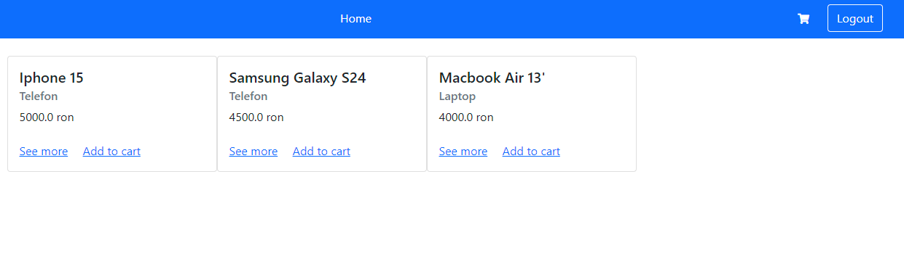

# MiniStore
## 1. Description
Built with Django, my mini-store offers a curated selection of products. It's a simple, yet efficient way for customers to browse, add items to their cart, and securely checkout.
## 2. Screenshot homepage
\
## 3. Technologies & Tools Used
Python: programming language\
Django: framework\
PyCharm: IDE (Integrated Development Environment)\
SQLiteStudio: database\
HTML, CSS, JS: creating and styling web pages

To run this program you need to install the Django package from the Command Prompt terminal\
using the command pip install.\
After that you may run the server from the same terminal using 'python manage.py runserver'

## 4. Instructions for installing and running the project

Clone this repository locally in the desired folder:\
git clone https://github.com/CriCon99/Mini_store_project.git

Create a virtual environment:\
py -m venv venv

Activate the virtual environment for Windows:\
venv\Scripts\activate

Or activate the virtual environment for Linux/Mac:\
source venv/bin/activate

Make sure we have installed before:\
pip install -r requirements.txt

Running the application will be done using the command:\
python manage.py runserver

